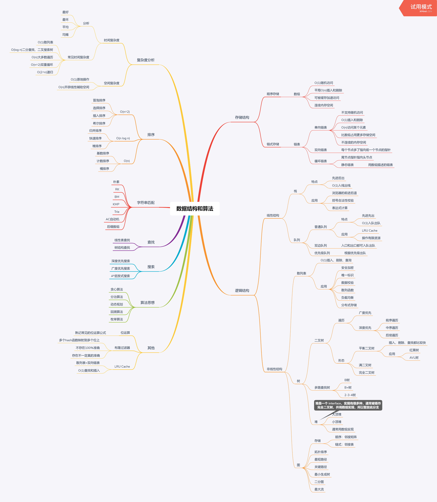

# 学习笔记
## 预习



## 爬楼梯问题通项公式推导过程

- 毫无思路时，尝试使用暴力破解，或者列举简单的几种情况，把规律寻找出来
- 程序的基本逻辑就是 if else loop recursion
- 找规律时的关键是**找最近重复子问题**
    ```
    当 n = 1 时，结果是 f(1)=1，
    当 n = 2 时，结果是 f(2)=2，
    当 n = 3 时，结果是 f(3)=3，此时的最近重复子问题是什么呢？
    首先，“最近”在这里是指，走到第 3 级台阶的最近步骤，由于一次只能是走 1 步或 2 步，因此，只能从第 2(=3-1) 级或第 1(=3-2) 级台阶走过来。那么如何到达第 2 级和第 1 级台阶的结果合集，就是 n = 3 时的结果。
    f(3) = f(1) + f(2)
    f(n) = f(n-2) + f(n-1)
    这是斐波那契数列的通项公式
    ```

## Queue

- java 中的队列 Queue 是一个接口，常见的实现类有

  - [ArrayDeque](https://docs.oracle.com/javase/8/docs/api/java/util/ArrayDeque.html)
  - [LinkedList](https://docs.oracle.com/javase/8/docs/api/java/util/LinkedList.html)
  - [PriorityQueue](https://docs.oracle.com/javase/8/docs/api/java/util/PriorityQueue.html)
  - [ArrayBlockingQueue](https://docs.oracle.com/javase/8/docs/api/java/util/concurrent/ArrayBlockingQueue.html)
  - [ConcurrentLinkedDeque](https://docs.oracle.com/javase/8/docs/api/java/util/concurrent/ConcurrentLinkedDeque.html)
  - [ConcurrentLinkedQueue](https://docs.oracle.com/javase/8/docs/api/java/util/concurrent/ConcurrentLinkedQueue.html)
  - [DelayQueue](https://docs.oracle.com/javase/8/docs/api/java/util/concurrent/DelayQueue.html)
  - [LinkedBlockingDeque](https://docs.oracle.com/javase/8/docs/api/java/util/concurrent/LinkedBlockingDeque.html)
  - [LinkedBlockingQueue](https://docs.oracle.com/javase/8/docs/api/java/util/concurrent/LinkedBlockingQueue.html)
  - [PriorityBlockingQueue](https://docs.oracle.com/javase/8/docs/api/java/util/concurrent/PriorityBlockingQueue.html)

- Queue 有两套 API，一套是会抛出异常，另一套返回 true/false/element

  |      | 抛出异常  | 返回特殊值 |
  | ---- | --------- | ---------- |
  | 插入 | add(e)    | offer(e)   |
  | 删除 | remove()  | poll()     |
  | 查看 | element() | peek()     |

  

## Deque

- java 中双端队列 Deque 是一个接口，继承了 Queue 接口，实现类有
  - [ArrayDeque](https://docs.oracle.com/javase/8/docs/api/java/util/ArrayDeque.html)
  - [ConcurrentLinkedDeque](https://docs.oracle.com/javase/8/docs/api/java/util/concurrent/ConcurrentLinkedDeque.html)
  - [LinkedBlockingDeque](https://docs.oracle.com/javase/8/docs/api/java/util/concurrent/LinkedBlockingDeque.html)
  - [LinkedList](https://docs.oracle.com/javase/8/docs/api/java/util/LinkedList.html)

## PriorityQueue

- java 中 PriorityQueue 是一个基于 priority head 的无界优先队列
- 不支持 null 元素，元素必须能够进行比较
- 可以通过实现了 Comparable 接口的元素或者构造时传入实现了 Comparator 的比较器实现比较
- iterator() 返回的迭代器是无序的
- 不是线程安全的，线程安全的版本是 [`PriorityBlockingQueue`](https://docs.oracle.com/javase/8/docs/api/java/util/concurrent/PriorityBlockingQueue.html)