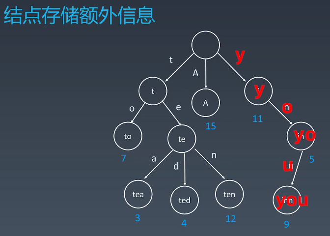
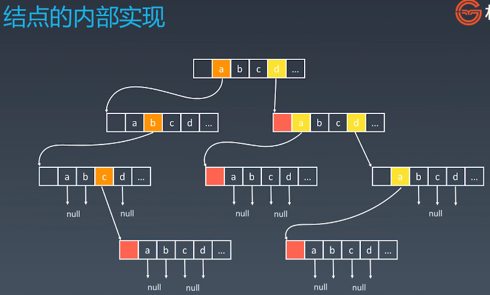

# 学习笔记

## 字典树 Trie

- 别名
  - 字典树
  - Trie
  - 单词查找树
  - 键树
  - 前缀树
- 典型应用：统计和排序大量的字符串（但不限于字符串），经常被搜索引擎系统用于文本词频统计
- 优点：最大限度地减少无谓的字符串比较，查询效率比 hash table 高
- 基本性质
  - 节点本身不存储完整单词
  - 从根节点到某一节点，路径上经过的字符连接起来，为该节点对应的字符串
  - 每个节点的所有子节点路径代表的字符都不相同

- 节点可以存储额外的信息，比如词频

- 字典树是多叉树

  

  

- 核心思想

  - 空间换时间
  - 利用字符串的公共前缀来降低查询时间的开销，以达到提高效率的目的

- go 实现的 Trie

  ```go
  type Trie struct {
  	Links []*Trie
  	IsEnd bool
  	R int
  }
  
  const c_R int = 26
  
  /** Initialize your data structure here. */
  func Constructor() Trie {
  	node := Trie{Links: make([]*Trie, 26), IsEnd: false, R: c_R}
  	return node
  }
  
  func (this *Trie) contains(ch byte) bool {
  	return this.Links[ch - 'a'] != nil
  }
  
  func (this *Trie) get(ch byte) *Trie {
  	return this.Links[ch - 'a']
  }
  
  func (this *Trie) put(ch byte, node *Trie)  {
  	this.Links[ch - 'a'] = node
  }
  
  
  /** Inserts a word into the trie. */
  func (this *Trie) Insert(word string)  {
  	node := this
  	for i := 0; i < len(word); i++ {
  		ch := word[i]
  		if !node.contains(ch) {
  			newNode := Constructor()
  			node.put(ch, &newNode)
  		}
  		node = node.get(ch)
  	}
  	node.IsEnd = true
  }
  
  func (this *Trie) searchPrefix(word string) *Trie {
  	node := this
  	for i := 0; i < len(word); i++ {
  		ch := word[i]
  		if node == nil || !node.contains(ch) {
  			return nil
  		}
  		node = node.get(ch)
  	}
  	return node
  }
  
  
  /** Returns if the word is in the trie. */
  func (this *Trie) Search(word string) bool {
  	node := this.searchPrefix(word)
  	return node != nil && node.IsEnd == true
  }
  
  
  /** Returns if there is any word in the trie that starts with the given prefix. */
  func (this *Trie) StartsWith(prefix string) bool {
  	node := this.searchPrefix(prefix)
  	return node != nil
  }
  ```

- 单词搜索ii
  - 使用 Trie 解的时间复杂度

- 并查集 Disjoint Set

  - 注意用于解决类似朋友圈的组团、配对问题
  - makeSet(s) 建立一个新的并查集，其中包含 s 个单元素集合
  - unionSet(x,y) 把元素 x 和 元素 y 所在的集合合并，并要求 x 和 y 所在的集合不相交，如果相交则不合并
  - find(x) 找到元素 x 所在的集合的代表，该操作也可以用于判断两个元素是否位于同一个集合，只要将它们各自的代表比较一下就可以了
  - 路径压缩：在查询时，可以随便将元素直接连到代表元素上，这样下次查找时，就可以实现 O(1) 复杂度
  - java 代码模板

  ```java
  class UnionFind { 
  	private int count = 0; 
  	private int[] parent; 
  	public UnionFind(int n) { 
  		count = n; 
  		parent = new int[n]; 
  		for (int i = 0; i < n; i++) { 
  			parent[i] = i;
  		}
  	} 
  	public int find(int p) { 
  		while (p != parent[p]) { 
  			parent[p] = parent[parent[p]]; 
  			p = parent[p]; 
  		}
  		return p; 
  	}
  	public void union(int p, int q) { 
  		int rootP = find(p); 
  		int rootQ = find(q); 
  		if (rootP == rootQ) return; 
  		parent[rootP] = rootQ; 
  		count--;
  	}
  }
  ```

## 启发式搜索

-  A* 搜索
- Heuristic search
- 就是在 BFS 或 DFS 搜索中，选取下一个层次的节点时，增加一个评估函数，评估节点的优先级，根据优先级放到一个优先队列中，从优先队列取时，就能够更快的到底目的
- 评估函数，比如棋盘或二位矩阵中的二点距离

