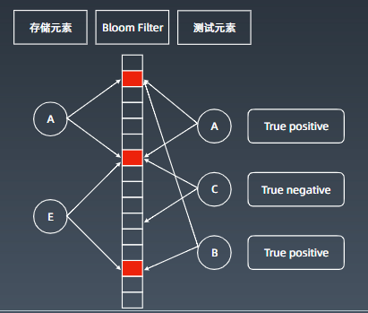
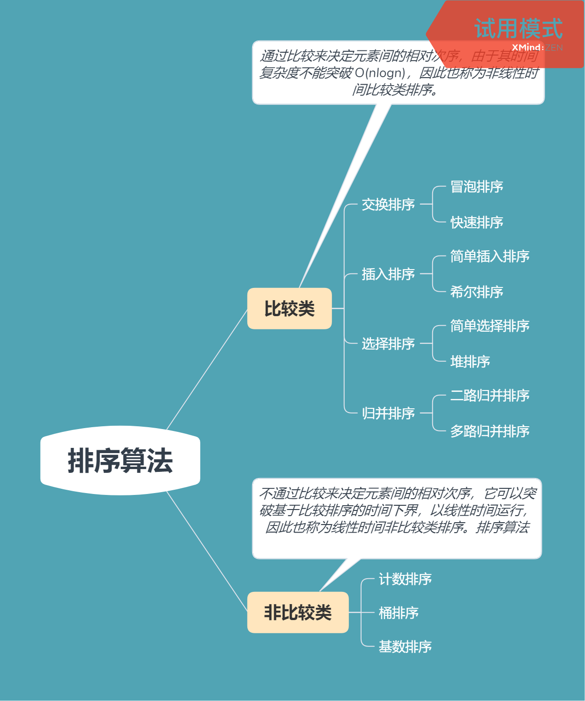
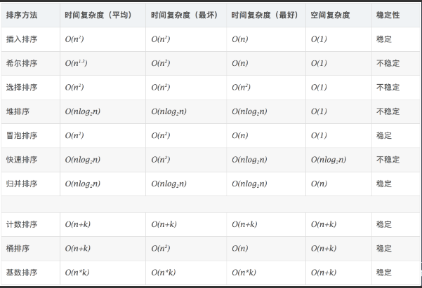

# 学习笔记

## 位运算

- 位运算符

  | 符号 | 意义                                 |
  | ---- | ------------------------------------ |
  | >>   | 右移，负数最高位 1 保留              |
  | <<   | 左移                                 |
  | >>>  | 无符号右移，高位都补充 0             |
  | \|   | 或，只要有一个 1 结果为 1            |
  | &    | 与，两个都是 1 结果才为 1            |
  | ~    | 取反                                 |
  | ^    | 异或，相同为 0，不同为 1。不进位加法 |

- 常用位运算

| 算式                      | 解释                            |
| ------------------------- | ------------------------------- |
| x^0=x                     | 任何数异或 0 等于本身           |
| ~0=1s                     | 全 0 取反得全 1                 |
| x^1s=~x                   | 任何数异或全 1 等于这个数取反   |
| x^(~x)=1s                 | 任何数与自身取反数异或得全 1    |
| x^x=0                     | 任何数与自身异或得 0            |
| c=a^b                     | a^c=b, b^c=a                    |
| a^b^c = a^(b^c) = (a^b)^c |                                 |
| x&(~0<<n)                 | 清零 x 最右边的 n 位            |
| (x<<n)&1                  | 取得 x 的第 n 位的值            |
| x&(1<<(n-1))              | 取得 x 的第 n 位的幂值          |
| x\|(1<<n)                 | 将 x 的第 n 位置为 1            |
| x&(~(1<<n))               | 将 x 的第 n 位置为 0            |
| x&((1<<n)-1)              | 将 x 从最高位到第 n 位置为 0    |
| x&(~((1<<(n+1))-1))       | 将 x 从第 n 位置到第 0 位置为 0 |
| x&1 == 1                  | 与 x%2 == 1 等价                |
| x&1 == 0                  | 与 x%2 == 0 等价                |
| x>>1                      | 与 x/2 等价                     |
| x&(x-1)                   | 将 x 的最低位的 1 置为 0        |
| x & -x                    | 取得 x 最低位的 1               |


## 布隆过滤器

- Bloom Filter

- 由一个很长的二进制向量和一系列随机映射函数组成

- 常与 hash table 进行比较

- 布隆过滤器只用于检索一个元素是否存在于集合中，不存储元素本身

- 优点是空间效率和查询时间都远远超过一般算法

- 缺点是有一定的误识别率和删除困难

  - 一个元素被判为不存在时，100%正确
  - 一个元素被判为存在时，是可能的，不能100%确定

  

- 应用案例
  - bit coin network
  - 分布式系统：Map-Reduce，Hadoop、search engine
  - Redis 缓存
  - 垃圾邮件、评论过滤
- [原理和实现](https://www.cnblogs.com/cpselvis/p/6265825.html)
- [缓存击穿、垃圾邮件识别、集合判重](https://blog.csdn.net/tianyaleixiaowu/article/details/74721877)

## LRU 缓存

- least recently used
- 一般使用 Hash Table 和 Double LinkedList 实现
- 除了 LRU Cache 还有 LFU 等等
  - LFU least frequently used
- [wiki](https://en.wikipedia.org/wiki/Cache_replacement_policies)

## 排序

- 排序算法分类



- 排序算法时间复杂度

  

- 冒泡排序

  ```go
  func bubbleSort(array []int) []int {
  	n := len(array)
  	if n <= 1 {
  		return array
  	}
  	for i := 0; i < n-1; i++ {
  		for j := 0; j < n-1-i; j++ {
  			if array[j] > array[j+1] {
  				array[j], array[j+1] = array[j+1], array[j]
  			}
  		}
  	}
  	return array
  }
  ```

- 选择排序

  ```go
  func selectionSort(arr []int) []int {
  	n := len(arr)
  	if n <= 1 {
  		return arr
  	}
  	for i := 0; i < n-1; i++ {
  		min := i
  		for j := i + 1; j < n; j++ {
  			if arr[j] < arr[min] {
  				min = j
  			}
  		}
  		arr[i], arr[min] = arr[min], arr[i]
  	}
  	return arr
  }	
  ```

- 插入排序

  ```go
  func insertionSort(arr []int) []int {
  	n := len(arr)
  	if n <= 1 {
  		return arr
  	}
  	for i := 1; i < n; i++ {
  		pre, cur := i-1, arr[i]
  		for pre >= 0 && arr[pre] > cur {
  			arr[pre+1] = arr[pre]
  			pre--
  		}
  		arr[pre+1] = cur
  	}
  	return arr
  }
  ```

- 排序算法动画演示
  - [十大经典排序算法](https://www.cnblogs.com/onepixel/p/7674659.html)
  - [9种经典排序算法](https://www.bilibili.com/video/av25136272)
  - [15种排序算法](https://www.bilibili.com/video/av63851336)