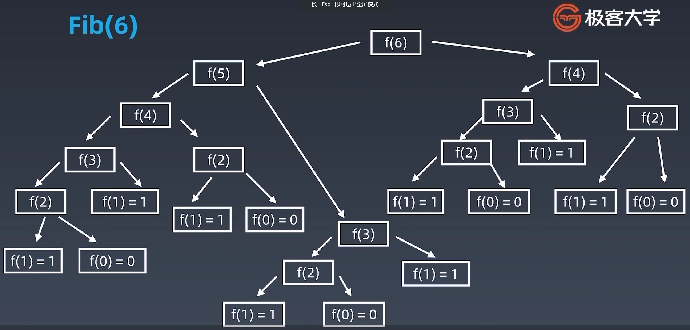
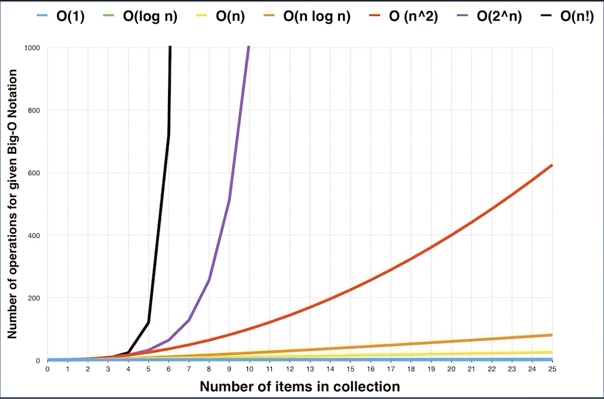
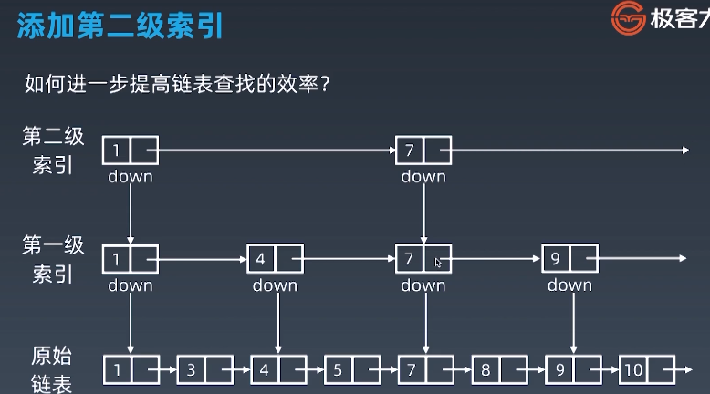
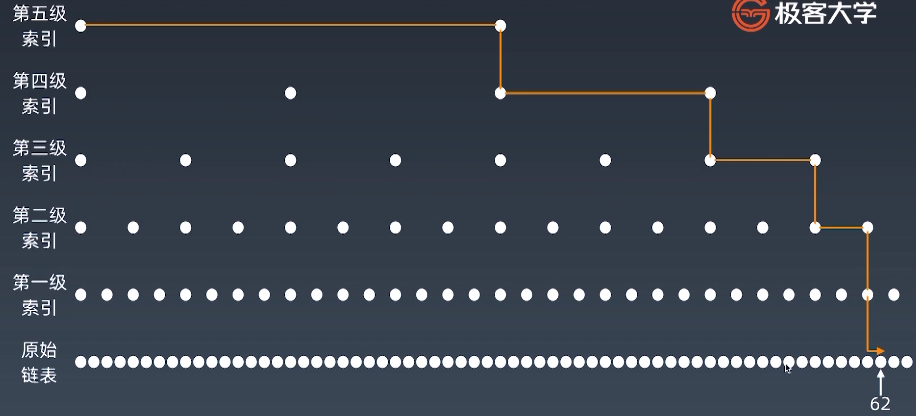

# 极客时间 覃超算法体验课程笔记

## lecture 1

### 时间复杂度

- 大 O 表示法，Big O Notation

- 7 种常见时间复杂度

  - 常数时间复杂度 O(1) Constant Complexity
  - 对数时间复杂度 O(log n) Logarithmic Complexity
  - 线性时间复杂度 O(n) Linear Complexity
  - N 平方时间复杂度 O(n^2) N square Complexity
  - N 立方时间复杂度 O(n^2) N Cubic Complexity
  - 指数时间复杂度  O(2^n) Exponential Growth
  - N 的阶乘 O(n!) Factorial

-  算复杂度时，忽略复杂度系数，只看最高复杂度

- 常见时间复杂度分析

  - 不管 n 的值是多少，代码只执行一次，不管多少行代码，都是常数时间复杂度 O(1)

  - 对于循环变量 n，单层循环时，不管代码中有多少个 for ，只要不嵌套，都是线性时间复杂度 O(n)

  - 对于循环变量 n，嵌套循环时，嵌套层数 m，时间复杂度是 O(n^m)

  - 对数时间复杂度 O(log n)

    ```go
    for i := 1; i < n; i = i*2 {
    	fmt.Println("looping at: ", i)
    }
    ```

  - 指数时间复杂度 -- 使用性能最差的递归方式来实现斐波那契数列 Fibonacci

    ```go
    func fib(n int) int {
        if n < 2 {
           return n
        }
    	return fib(n - 1) + fib(n -2)
    }
    ```

    - 递归时间复杂度分析
      - 代入一些 n 的值，看函数调用次数，类推出函数调用次数与 n 的关系
      - 例如 n = 6 时，如上递归 Fibonacci 函数的调用次数，如下图以看到树有 6 层，每层节点数为 2 的次方，第 6 层节点数为 2 的 6 次方，故为指数级时间复杂度 O(6^2)
      - 
    - Fibonacci 函数改进方案
      - 对中间结果进行缓存，减少重复计算
      - 使用单层循环

- 时间复杂度曲线

  - 

- 主定理 Master Theorem

  - 用来计算递归函数的时间复杂度

  - 关键 4 种

    | Algorithm 算法                                | 递归公式                  | 时间复杂度 | 说明               |
    | --------------------------------------------- | ------------------------- | ---------- | ------------------ |
    | Binary search 二分查找                        | T(n) = T(n/2) + O(1)      | O(log n)   |                    |
    | Binary tree traversal 二叉树遍历              | T(n) = 2T(n/2) + O(1)     | O(n)       | 每个节点只访问一次 |
    | Optimal sorted matrix search 有序二维矩阵搜索 | T(n) = 2T(n/2) + O(log n) | O(n)       |                    |
    | Merge sort 归并排序                           | T(n) = 2T(n/2) + O(n)     | O(n log n) |                    |

  - 图的遍历时间复杂度 O(n)

  - 搜索算法，广度优先 BFS，深度优先 DFS 时间复杂度 O(n)

### 空间复杂度

- 数组长度 n ，空间复杂度 O(n)
- 有递归时，递归深度 n，空间复杂度 O(n)

## lecture 2

### 数组 Array

- 连续的内存地址，随机访问 look up 时间复杂度为 O(1)
- 插入、删除操作需要移动元素，时间复杂度是 O(n)
- 对于 java 的ArrayList 、Python 的 List、Go 的 Slice，自动扩展 size 时，实际是创建一个 2 倍的 size 的新数组

### 链表 Linked List

- 链表不是使用连续的内存地址，元素之间通过指针进行连接
- 一个元素只有一个指针，是单链表。有两个指针，是双向链表。首尾元素指针相接是循环链表
- 插入、删除元素操作时间复杂度是 O(1)
- 随机访问元素 look up 的时间复杂度是 O(n)
- [LRU 缓存机制](http://leetcode-cn.com/problems/lru-cache)

### 跳表 Skip List

- 比其他数据结构出现的比较晚，在 90 年代

- Skip List 的元素是有序的

- Redis 使用的是 Skip List

- 用于加速查询

- 加速查询的核心思想是升维，得到更多的信息，空间换时间

- Skip List 的升维方法是增加多级索引

- 查询的时间复杂度是 O(log n)。由于增加的索引节点数是收敛的，空间复杂度还是 O(n)

- 

  

  - [为啥 Redis 使用跳表（Skip List）而不是使用 Red-Black？](http://www.zhihu.com/question/20202931)

### 刷题练习步骤

- 读题后思考在 10 分钟内
- 思考之后有思路的话，尝试自己写，不然马上看题解
- 默写背诵、熟悉
- 自己写一遍
- 查看别人的优秀写法（leetcode 的国际站）

## lecture 3

- 树是链表的特殊形式，单链表的一个节点只有一个指针，树的一个节点可以有多个指针

### 二叉树

- 二叉树的每个节点最多有两个指针
- 当树的节点指针指向其他分支时，就是图，所以树是图的特殊形式
-  Fibonacci 递归实现扩展出来的树，叫递归树
- 树的遍历，按照访问一个节点值的顺序分为如下 3 种（访问子树时，也是按照同样的方法）：
  - 前序遍历 pre order traverse：先访问根节点值，再访问左子树，最后访问右子树
  - 中序遍历 in order traverse：先访问左子树，再访问根节点值，最后访问右子树
  - 后序遍历 post order traverse：先访问左子树，再访问右子树，最后访问根节点值

### 二叉搜索树

- 也叫二叉排序树，有序二叉树 Ordered Binary Tree，排序二叉树 Sorted Binary Tree
- 二叉搜索树是指一颗空树，或者有如下性质的二叉树
  - 左子树上的所有节点的值都小于它的根节点的值
  - 右子树上的所有节点的值都大于他的根节点的值
  - 任意一个子树都符合以上两点
- 二叉搜索树的中序遍历结果是升序的

- 查询：根据节点之间值大小的排序关系，查询方法非常简单
- 插入：确定一个值应该插入哪个位置的过程，就是搜索的过程，搜索到最后的节点，就是待插入节点的父节点
- 删除：删除前，首先需要搜索定位到节点
  - 如果删除的是叶子节点，因为没有子节点，直接删除即可
  - 如果不是叶子节点，则从右子树中，选一个值与被删除节点值相差最小的节点代替被删除节点

- 查询、插入、删除的平均时间复杂度是 O(log n)。特殊情况下，树程单链表状是，时间复杂度会差点，是 O(n)

- 由于二叉树的特性，使用递归实现遍历非常方便
- 递归不是造成性能差的根本原因，现代计算机对递归进行了优化，只要递归深度不是特别深，与循环的性能几乎相当