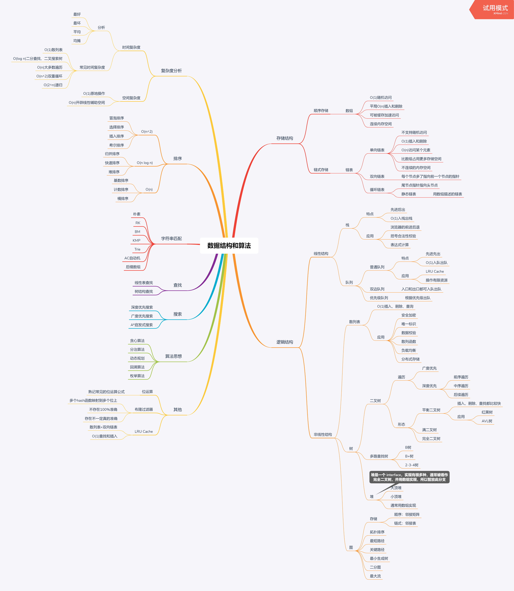
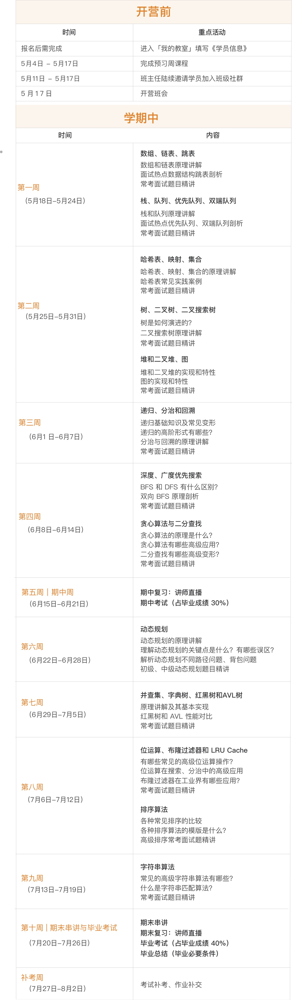
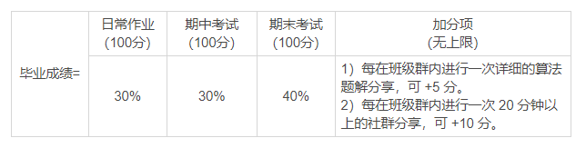

# 极客时间 覃超 算法课程笔记

## 预习课

- 课件预习
- 书 Outliers，中文版《异类：不一样的成功启示录》
  - Chunk it up 切碎知识点
  - Deliberate practicing 刻意练习
  - Feedback 反馈

- 数据结构的分类
  - 一维
    - 基础：数组 array，链表 linked list
    - 高级：栈 stack，队列 queue，双端队列 deque，集合 set，映射 map（hash or map），etc
  - 二维：
    - 基础：树 tree，图 graph
    - 高级：二叉搜索树 binary search tree (red-black tree, AVL)，堆 heap，并查集 disjoint set，字典树 Trie，etc
  - 特殊：
    - 位运算 Bitwise，布隆过滤器 Bloom Filter
    - LRU cache
- 算法
  - 基石
    - if-else，switch --> branch
    - for while loop --> iteration
    - Recursion 递归 (Divide & Conquer 分治，Backtrack 回溯)
  - Search 搜索：Depth first search 深度优先搜索，Breadth first search，A*, etc
  - Dynamic Programming 动态规划
  - Binary Search 二分查找
  - Greedy 贪心算法
  - Math 数学， Geometry 几何

- 脑图

  

- 刻意练习

  - 多遍练习
  - 五毒神掌
  - 刻意练习缺陷、弱点

- 切题四件套

  - Clarification 正确理解题目
  - Possible solutions 多种解题思路
    - compare time and space 比较时间与空间消耗
    - optimal 加强
  - Coding
  - Test cases

- 五毒神掌
  - 第一式
    - 5-10分钟读题思考
    - 思考有思路则开始尝试写
    - 无思路则直接看解法
    - 最后还是要看题解，多种解法，比较优略，看国际站
  - 第二式
    - 将自己写的代码在 LeetCode 上提交通过
    - 可以提交多种解法进行优化
  - 第三式
    - 过一天后，再重复做题
    - 不同解法的熟练程度 --> 专项练习
  - 第四式
    - 一周后再次练习
  - 第五式
    - 面试前一周恢复性练习

## 开学班会

### 课程表

### 课程内容

- 每周完成教学视频的观看
  - 周日 0 点解锁
- 按时参加讲师直播答疑
- 每周按时完成并提交算法题作业
  - 周日 0 点前提交
  - 至少完成并提交 2 道代码作业
  - 仓库代码链接：https://github.com/algorithm009-class02
  - 作业提交方式 https://shimo.im/docs/JkyUZeq3Q44rX2p5/
- 每周按时完成并提交学习总结
  - 每周完成一篇学习总结
  - 写在应提交作业的周目录内，README.md 文件中
- 助教答疑
- 参加线上班级活动

- 第五周（6月15日-6月21日）：期中考试，期间无教学内容，讲师进行直播复习，大家需要完成期中考试，期中考试占最终毕业成绩的 30%
- 第十周（7月20日-7月26日）：期末考试，讲师进行直播复习，大家需要完成期末考试，并提交毕业总结，期末考试占最终毕业成绩的 40%
- 课件
  - 可提前预习
  - 链接: https://pan.baidu.com/s/1VQEJb6BE1YL4AbEZT0icYg   密码:un6x

- 毕业条件（以下三个都需要满足）：
  - 毕业成绩达到 60 分（毕业成绩构成如下图）
  - 完成并提交毕业总结
  - 视频观看完成度为 80%、
- 每周四晚上是社群分享时间
  - 击链接报名哦～：https://www.infoq.cn/form/?id=172

- 成绩组成

  

- 毕业成绩在 100 分以上的同学，为“优秀学员”，可获得 ¥299 学费返还

- 分组 https://shimo.im/docs/hggoBAvERSsEYQak/ 《算法训练营9期-2班分组》